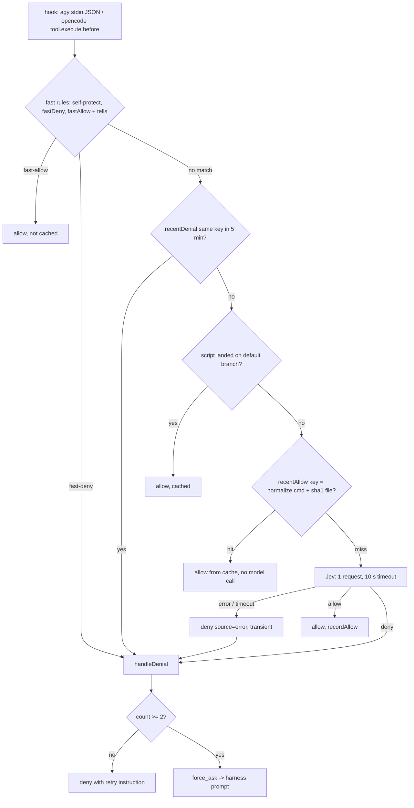
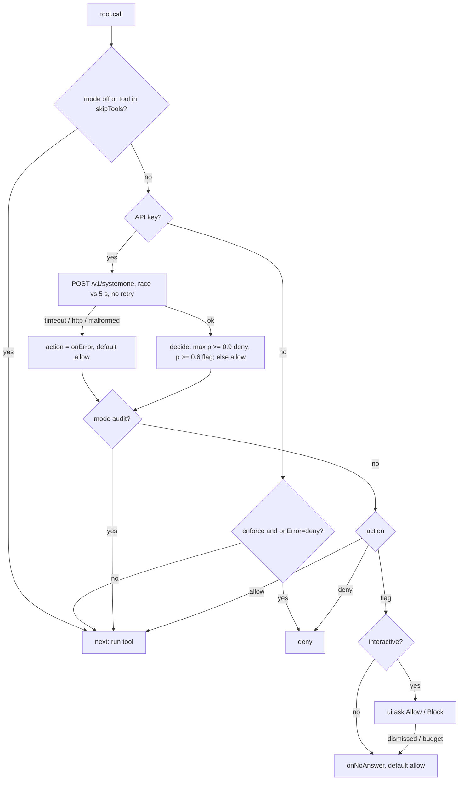
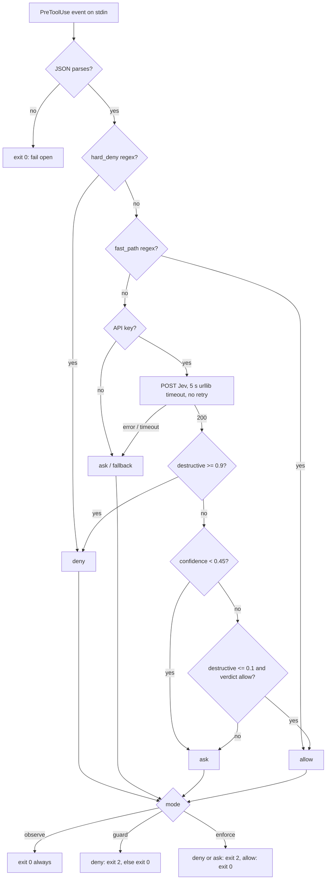
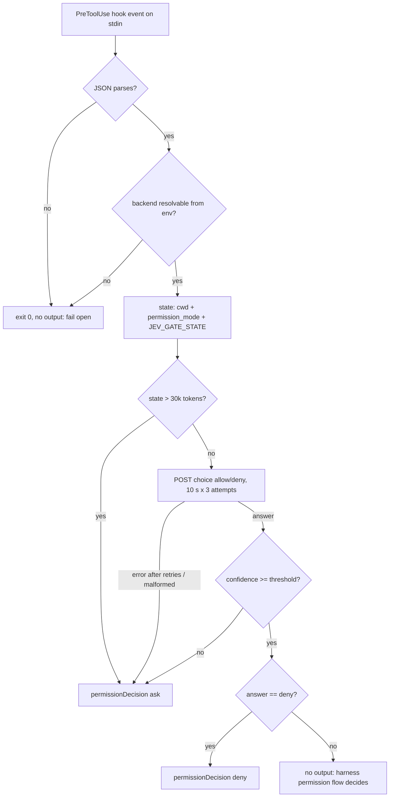
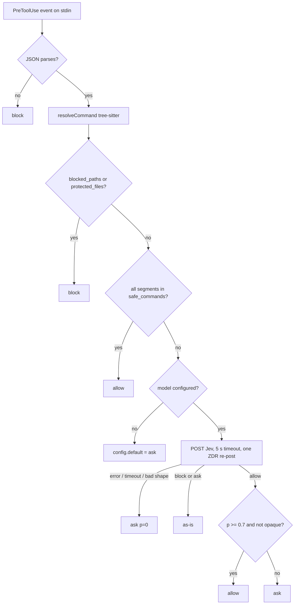
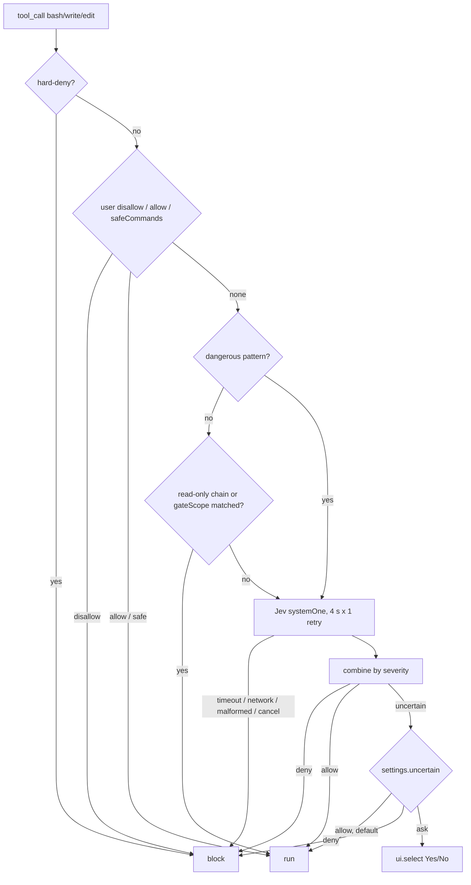
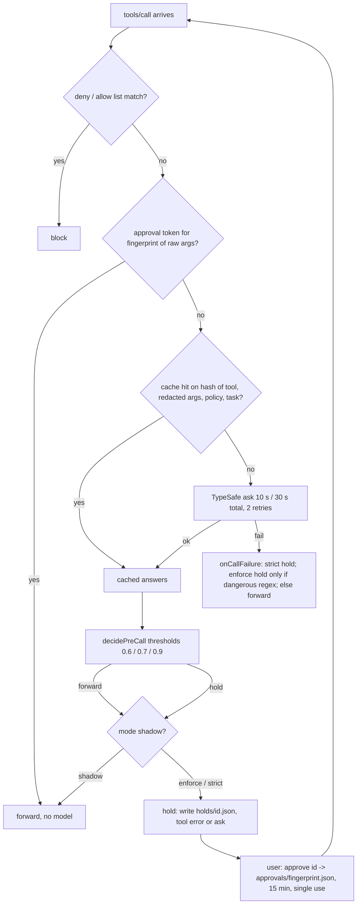
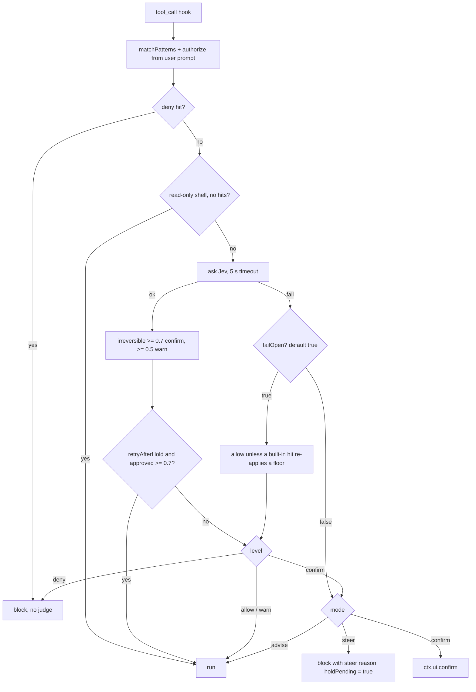

# Survey: decision flows of Jev-backed tool-call guards

This document records what we found by reading the source code of twelve
guards listed in the *Agent tooling* and *Browser & computer use* sections of
[awesome-jev](https://github.com/mizchi/awesome-jev). README claims were not
trusted; every statement below cites a file and line in the commit that was
read. All twelve were cloned as shallow checkouts on 2026-09-23.

The question we asked of each repository was the same: **can the combination
of a verdict cache, a fail-open fallback, retries, and a context change let an
irreversible action run without a fresh judgment or a human approval?**

## Summary table

| Repository | Commit | Intercepts | Verdict cache | Timeout default | On model failure | Retries | Human "ask" | Black-box test seam |
|---|---|---|---|---|---|---|---|---|
| construct-auto-classifier | 9062b34 | agy PreToolUse hook, OpenCode `tool.execute.before` | **Yes**: model allows, 5 min, per session, on disk. Key = normalized command (drops `sudo`, env prefixes, quotes, output shapers). No cwd in key. | 10 s (Jev) | deny, then `force_ask` after 2 identical attempts | none (Jev path) | harness prompt | `auto-classifier agy` on stdin, `TYPESAFE_BASE_URL`, `XDG_RUNTIME_DIR`, `HOME` |
| stepwarden | f5819c1 | Claude Code function hook `tool.call` | no | 5 s | **allow** (`onError` default) | none | `$.ui.ask` in enforce mode only | plugin test harness only (`API_BASE` hard-coded) |
| jev-engineering | 3161dbf | Claude Code PreToolUse (Bash, Edit, Write, NotebookEdit) | no | 5 s | `ask`, which is **exit 0** in `observe` and `guard` modes | none | exit 2 in `enforce` only | `python3 jev_gate.py` on stdin, `JEV_ENDPOINT` |
| jev-use | 541c86c | Claude Code / Codex PreToolUse, MCP, Pi | no | 10 s x 3 attempts | `ask`; bad stdin or missing key: **silent allow** | 2 | `permissionDecision: ask` | `jev-use hook gate` on stdin, `TYPESAFE_BASE_URL` |
| jev-firewall | 7cab712 | Claude Code / Codex PreToolUse | no | 5 s | `ask` (p = 0); thrown errors: block | 1 (ZDR re-post only) | `permissionDecision: ask` | `jev-firewall check claude` on stdin, `JEVD_BASE_URL` |
| pi-jev-auto-mode | 06a5604 | Pi `tool_call` (bash, write, edit) | no | 4 s x 1 retry | block | 1 (SDK) | `ctx.ui.select` only if `uncertain: ask`; default is **allow** | exported `evaluateToolCall`, `options.fetch` |
| agent-chaperone | c59a1e0 | MCP proxy (`tools/call`) plus PreToolUse hooks adapter | **Yes**: in-memory, process lifetime, no TTL, 2048 entries. Key = sha256(tool name, redacted args, policy text, task text, questions). No cwd, server, or session in key. | 10 s per attempt, 30 s total | `shadow` (default): forward always; `enforce`: forward unless a dangerous regex matched; `strict`: hold | 2 (SDK) | hold + `approve <id>` (15 min, single use, raw-args key); hook emits `ask` | library only: `createTypeSafeBackend({ baseUrl, fetch })`, `runPreHook`, `createScreeningGate` |
| pi-warden | cb807de | Pi `tool_call` (bash, write, edit) | no cross-call cache; sibling prejudging per `toolCallId` only | 5 s | **allow** unless a built-in pattern hit (`failOpen: true` default) | none in repo | steer hold, then a post-hold approval question judged against the *next* confirm-level call | stub `Judge` object only; no endpoint env var |
| agent-fastpath | e1bf8db | MCP server, advisory | no | 5 s x 3 attempts | `status: error`, advisory | 2 | `recommendedAction: ask_user`, advisory | provider injection only (endpoint not env-configurable) |
| hermes-jev-approvals | 530fdb0 | Hermes smart-approval reviewer (model provider plugin) | no | 30 s, 25 s deadline | raise, Hermes core escalates | 3 | ESCALATE verdict | none without patching (https:443 enforced) |
| jev-layer | b6a3cf4 | capability router, never executes | no | 2 s | `status: fallback`, advisory | none | `needs_confirmation`, advisory | `options.provider`, `TYPESAFE_ENDPOINT` |
| jevcache | da5e950 | OpenAI-compatible chat proxy, not a tool gate | **Yes**: exact tier plus Jev "same intent" tier | n/a | forward upstream | n/a | n/a | HTTP proxy |

Two repositories that gate tool calls keep a verdict cache:
**construct-auto-classifier** (on disk, 5 minutes, key drops `sudo` and env
prefixes, no cwd) and **agent-chaperone** (in memory for the life of the proxy
process, no TTL, key uses redacted arguments while the human-approval key uses
raw arguments). jevcache also has a semantic cache, but it caches chat
completions and explicitly bypasses any request that carries tools, so it never
sits in front of a tool call. The fail-open defaults are in stepwarden
(`onError: allow`), jev-engineering (mode-gated exit 0), jev-use (silent allow
on bad stdin or missing credentials), agent-chaperone (`shadow` default, and
`enforce` forwards on failure unless a regex matched), and pi-warden
(`failOpen: true`). No repository had a request/response correlation problem:
every one awaits a single promise per call or runs one process per call. The
closest analogue is pi-warden's post-hold approval, which is judged against
the next confirm-level call rather than the call that was held.

## construct-auto-classifier

**What it is.** A shell-command gate with two adapters: a Google Antigravity
(`agy`) PreToolUse hook that reads the tool call as JSON on stdin and prints
`{decision: allow|deny|ask|force_ask}` (`src/adapters/agy.ts:243-254`), and an
OpenCode plugin implementing `tool.execute.before` (`src/adapters/opencode.ts:106-206`).
Structural rules run first, then one Jev request with a verdict choice and nine
risk nouls (`src/classifier/jev-client.ts:131-135`), combined fail-closed
(`jev-client.ts:138-168`).

**Decision flow.**



**Cache.** Two per-session lists in an on-disk state file
(`src/state/state-manager.ts:21-37`): `recentAllows` (model allows) and
`recentDenials`. The allow lookup happens before the model call
(`src/index.ts:164-172`):

```ts
const cached = this.stateManager.recentAllow(sessionId, trimmed, contextKey);
if (cached) {
  return { outcome: { decision: "allow", reason: `${cached.reason} (same verdict as earlier in this session)`, ... }, source: "cache", fileContext };
}
```

The key is `normalizeCommand` (`state-manager.ts:107-125`) over each
segment's `stripped` form. `parseSegment` (`src/rules/command-shape.ts:224-245`)
drops leading `NAME=value` assignments and the wrappers `sudo doas command
builtin nohup time nice` with their flags before taking the verb. Quotes are
removed by `splitWords`, `2>&1` style redirections are erased, trailing `| head
| tail | cat | less | more | wc | tee` segments are dropped, and every separator
becomes `" ; "`. The key contains no cwd, environment, tool name, or git state.
The state sent to the model is `{ command }` plus an optional script file
(`jev-client.ts:115-129`); cwd is not sent either. TTL is
`slidingWindowMs` = 300 000 ms (`src/config.ts:284-285`), eviction 50 allows
FIFO, persistence under `$XDG_RUNTIME_DIR/auto-classifier/sessions/` or
`~/.cache/auto-classifier/sessions/` (`state-manager.ts:73-80`), files older
than two hours removed on construction. Irreversibility is not consulted when
storing or serving cache entries.

**Timeout, error, retry.** `jev.timeoutMs` default 10 000 (`config.ts:362`),
AbortController (`jev-client.ts:174-187`). Any transport failure or malformed
answer is `{allow: false, source: "error"}` (`jev-client.ts:257-260`),
recorded as a transient denial that still counts toward
`consecutiveThreshold` = 2 (`src/index.ts:205, 256-268`). The second identical
attempt while the model is down becomes `force_ask`. No retry on the Jev path.
One process per agy hook call; the state file is read-modify-written without a
lock (`state-manager.ts:132-170`).

**Human approval.** `ask` and `force_ask` are the harness's own prompt. The
plugin never replies "always" (`opencode.ts:198-202`) and remembers nothing
about the operator's answer.

**Public API for a replay.** `auto-classifier agy` with
`{conversationId, toolCall: {name: "run_command", args: {CommandLine, Cwd}}}`
on stdin (`agy.ts:203-206, 227-229`); `TYPESAFE_BASE_URL` for the endpoint
(`config.ts:356`), `TYPESAFE_API_KEY`, `AUTO_CLASSIFIER_PROVIDER=jev`,
`XDG_RUNTIME_DIR` to isolate the cache, `HOME` to isolate config and
telemetry. Tests use `bun test` under `tests/`.

**Suspicious spots (confirmed by reading, reproduced black-box on 2026-09-23).**

- A model allow for `rm -rf build` obtained in one cwd is served from the cache
  for the same text in any other cwd within five minutes. The model never saw
  either cwd.
- `sudo rm -rf build` shares the key with `rm -rf build`, so a privilege
  escalation is served from the cache of the unprivileged command.
- `PATH=/tmp/x cmd` and `LD_PRELOAD=... cmd` share the key with `cmd`. The
  fast-allow path refuses these as "tells" (`command-shape.ts:277-280`); the
  cache path does not check tells.
- Quotes are removed in `splitWords`, so `echo '$(rm -rf /)'` and
  `echo $(rm -rf /)` normalise to the same key. The first is a literal; the
  second executes the substitution. Needs an end-to-end test.
- Missing session ids collapse into shared buckets (`opencode-session`,
  `agy-session`, `default-session`), so allows leak between sessions.

## stepwarden

**What it is.** A Claude Code plugin on the early-access function-hooks API.
The `tool.call` hook (`hooks/verify.ts:526-758`) POSTs every non-skipped tool
call to TypeSafe and returns `{deny}` or calls `next(e)`. It ships in `audit`
mode, which never blocks (`lib/config.ts:24-29`; `verify.ts:632-633`).



**Cache.** None. Session state is plan, last-8 history, failure count, stats,
keyed `stepwarden:<sessionId>:<suffix>` (`lib/keys.ts:22-30`). The plan is the
first prompt of the session only (`verify.ts:511`).

**Timeout, error, retry.** `timeoutMs` default 5000 (`lib/config.ts:41`)
implemented as `Promise.race` against `$.clock.sleep`; the HTTP request is not
cancelled (`verify.ts:346-367`). Every failure (timeout, 5xx, non-JSON,
missing answer, missing key, hook crash) becomes `config.onError`, default
`allow` (`lib/config.ts:38`; `verify.ts:623-626, 735-757`). No retries. One
awaited race per call, no shared verdict slot.

**Human approval.** `$.ui.ask` with Allow/Block (`verify.ts:660-663`) only in
`enforce` mode for `flag` decisions in an interactive session. Dismissed,
rate-limited (one per 2 s), or over the 50-question budget: `onNoAnswer`,
default `allow` (`verify.ts:673-687`). Nothing is remembered.

**Public API.** `API_BASE` is hard-coded (`lib/jev.ts:29`); the only seam is
the plugin test harness (`on("http.fetch", ...)`, `tests/gate.test.ts:69-85`).

**Suspicious spots.** Fail-open on every verification failure by default; a
Jev outage in `enforce` mode lets everything through with a toast after three
failures. `onNoAnswer: allow` means two flagged calls inside two seconds allow
the second. `mode: audit` default never blocks; the tests pin that
`rm -rf /etc/nginx` runs in audit mode (`tests/gate.test.ts:379-403`).

## jev-engineering

**What it is.** A Claude Code plugin whose PreToolUse hook
(`hooks/hooks.json:5-11`, matcher `Bash|Edit|Write|NotebookEdit`, hook
timeout 8 s) runs `python3 jev_gate.py`: hard-deny regexes, a fast-path
allowlist, then one Jev request with a `destructive` noul and a `verdict`
choice. It signals by exit code only: 0 permits, 2 blocks
(`jev_gate.py:263-271`).



**Cache.** None. The only persisted rules are the layered policy files
(`policy.py:133-147`), which cache rules, not decisions.

**Timeout, error, retry.** `JEV_GATE_TIMEOUT` default 5 s
(`jev_gate.py:49, 120`). `HTTPError`, `URLError`, `TimeoutError`, `ValueError`
all return `None` (`jev_gate.py:121-123`), which `decide` turns into
`ask/fallback "model unreachable"` (`jev_gate.py:141-142`). In the default
`observe` mode and in `guard` mode, `ask` is exit 0, which is Claude Code's
own permission flow (`jev_gate.py:263-271`). A malformed 200 body raises an
uncaught `KeyError` at `jev_gate.py:144-148`, exit 1, which Claude Code treats
as a non-blocking hook error. No retries. One process per call.

**Human approval.** The hook never emits `permissionDecision: ask`. In
`enforce` mode an `ask` is exit 2 with a stderr message that Claude Code
feeds back to the model, not a human prompt.

**Public API.** `echo '<event>' | python3 jev_gate.py`, `JEV_ENDPOINT` for a
fake server, `JEV_GATE_MODE`, `JEV_GATE_TIMEOUT`, `JEV_GATE_LOG`,
`OPENROUTER_API_KEY`. Tests are plain scripts under `tests/`.

**Suspicious spots.** Default mode `observe` exits 0 for every verdict
including hard-rule deny. In `guard` mode every fallback (`no API key`,
`model unreachable`, timeout, low confidence, model `ask`) is exit 0. The hook
timeout of 8 s with a 5 s per-operation socket timeout can be exceeded by a
slow-drip endpoint. Team and local policy files can add `fast_path` regexes
and replace `questions` wholesale (`policy.py:101-115`).

## jev-use

**What it is.** A Claude Code / Codex PreToolUse hook adapter (`jev-use hook
gate`, `src/cli.ts:160-199`), an MCP server, and a Pi extension. Only the
hook form enforces: one allow/deny choice question, emitting `deny` or `ask`,
or nothing for `allow` so the harness decides.



**Cache.** None. Each hook call is a fresh `npx` process.

**Timeout, error, retry.** 10 000 ms per attempt, up to 3 attempts with
exponential backoff (`src/backends/http.ts:13-14, 85-106`). Backend failure
after retries or a malformed answer becomes `escalate` and then `ask`
(`src/judge.ts:70-84`; `src/cli.ts:182-183`). Fail-open paths: unparseable
stdin (`src/cli.ts:164-167`), missing credentials or unknown backend, or any
non-`BackendError` exception (`src/cli.ts:196-198`), all exit 0 with no
output. The identical body is re-sent on retry with no request id.

**Human approval.** `permissionDecision: ask`. Nothing remembered.

**Public API.** `jev-use hook gate` on stdin, `JEV_BACKEND=typesafe
TYPESAFE_API_KEY=x TYPESAFE_BASE_URL=http://127.0.0.1:PORT`
(`src/backends/index.ts:75-83`). vitest under `test/`.

**Suspicious spots.** Silent fail-open when credentials are missing in the
hook's environment. Worst-case duration (3 x 10 s plus backoff plus `npx`
startup) exceeds the shipped 30 s hook timeout. Deny is recognised only by the
exact label `"deny"` (`src/judge.ts:229-230`); any other label maps to allow.

## jev-firewall

**What it is.** A Claude Code and Codex PreToolUse hook that reads one JSON
event per stdin line and writes one decision line. Deterministic rules
(tree-sitter de-obfuscation, `blocked_paths`, `protected_files`,
`safe_commands`) run first (`src/rules.ts:47-107`); unmatched actions go to
Jev for allow/ask/block.



**Cache.** None. The only remembered state is a per-process ZDR flag
(`src/model.ts:75, 129`).

**Timeout, error, retry.** `JEVD_HTTP_TIMEOUT_MS` default 5000
(`src/model.ts:81`). Every model-side failure is `ask` with probability 0
(`src/model.ts:133-160`); any thrown error is `block` (`src/decide.ts:115-124`).
One retry only for the zero-data-retention re-post. One process per call.

**Human approval.** `permissionDecision: ask`. No approval memory; the README
notes that Claude Code's own "always allow" bypasses hooks entirely.

**Public API.** `jev-firewall check claude` on stdin, exit 2 on block;
`JEVD_BASE_URL`, `JEVD_PROVIDER`, `TYPESAFE_API_KEY`, `JEVD_CONFIG`.
`node:test` under `src/test/`.

**Suspicious spots.** The Claude adapter emits `permissionDecision: "block"`
(`src/claude-adapter.ts:44-52`) while Claude Code's documented vocabulary is
`allow | deny | ask`; if the host rejects the unknown value, a block degrades
to the normal permission flow. `safe_commands` strips one trailing
redirection before matching, so `pwd > ~/.bashrc` is a rule allow. Config and
`.env` are discovered from the project cwd, so a project can point the model
at an arbitrary endpoint.

## pi-jev-auto-mode

**What it is.** A Pi extension gating `bash`, `write`, and `edit`
(`src/call.ts:13-15`). Deterministic policy first (hard-deny, user rules,
`safeCommands`, dangerous-pattern reasons), then one Jev request carrying all
applicable rule questions, combined by severity (`src/jev/decide.ts:112-187`).



**Cache.** None. The `observed` map stores last probabilities for threshold
tuning only (`src/extension.ts:516-530`).

**Timeout, error, retry.** `timeoutMs` 4000, `maxRetries` 1, delegated to the
official SDK (`src/settings.ts:83-84`; `src/jev/transport.ts:89-97`). Every
failure is a block (`src/jev/transport.ts:37-46`; `src/extension.ts:349-356`).
Locals per call; a late response cannot attach to another call.

**Human approval.** Only when the engine says `uncertain` and
`settings.uncertain === "ask"`. The default is `allow` (`src/settings.ts:90`),
which contradicts `docs/security.md:63`. Not remembered.

**Public API.** `evaluateToolCall` and `RegisterOptions.fetch` are exported
for tests (`src/extension.ts:199-209, 468-479`). No endpoint env var.

**Suspicious spots.** Hazard-mode rules treat the uncertain band as satisfied
(`src/jev/decide.ts:64`), so a command the model is merely unsure about runs
without a human. Soft rules are cleared by `intent_coverage` over the last 12
user messages (`src/jev/decide.ts:137-157`). `safeCommands` outranks
dangerous-pattern matches, and `rm -rf build` inside cwd has its deletion
reasons stripped under `gateScope: matched`.

## agent-chaperone

**What it is.** A transparent MCP proxy that screens `tools/call` requests
before relaying them (`src/screening/gate.ts:760-769`), plus a hooks adapter
for a client's built-in tools that emits a PreToolUse `permissionDecision`
(`src/hooks/run.ts:116-239`). Verdicts are forward, block, or hold. A held
proxy call is answered with a tool error naming an id; the user runs
`agent-chaperone approve <id>` and the agent retries the identical call.
Modes are `shadow` (default), `enforce`, and `strict`
(`src/policy/schema.ts:19, 89`).



**Cache.** `cachingBackend` wraps the model backend for both the proxy and
the hook (`src/cli/main.ts:696, 810`). The key is a hash of the whole request:
tool name, **redacted** arguments, policy text, task text, and the question
battery (`src/backends/hash.ts:77-80`; `src/screens/precall.ts:83-97`). A hit
returns the stored answers without calling the model
(`src/backends/cache.ts:68-77`):

```ts
const key = requestHash(state, battery);
const known = answers.get(key);
if (known !== undefined) { hits += 1; ...; return known as BackendResult<B>; }
```

There is no TTL. Eviction is insertion order with re-insert on hit, capped at
2048 entries (`cache.ts:28, 89-94`). The cache lives for the process, which
for the proxy is the whole MCP session. The key contains no server name, cwd,
environment, or session id. The approval fingerprint, by contrast, uses raw
arguments precisely because "fingerprinting the redacted form let one approval
release a different request to a different resource"
(`src/approvals/approvals.ts:14-19`). Irreversibility is not consulted when
storing or serving; only `answer.ok` is (`cache.ts:82-88`).

**Timeout, error, retry.** 10 000 ms per attempt, 30 000 ms total, two SDK
retries (`src/backends/typesafe.ts:47-50, 220-232`). `onCallFailure`
(`gate.ts:263-283`): list blocks still apply; `strict` holds; `enforce` holds
only when one of the twelve dangerous shell regexes matched; otherwise
forward. `shadow` applies forward always (`src/policy/decisions.ts:305-307`).
A gate exception in `enforce` forwards because `onCallBug` passes
`dangerous = false` (`gate.ts:737-741`). The proxy pauses the source stream
while a verdict is in flight and binds each verdict to its envelope by
closure (`src/proxy/proxy.ts:298-351`), so a late answer cannot land on a
later call.

**Human approval.** Hold plus `approve <id>`, which writes a single-use token
keyed by raw arguments with a 15-minute TTL (`approvals.ts:40, 183-244`). An
approved retry skips the model entirely. The hook form emits
`permissionDecision: ask`.

**Public API.** `createScreeningGate`, `decidePreCall`, `cachingBackend`,
`createTypeSafeBackend({ baseUrl, fetch, ... })`, `runPreHook`, and
`createProxy` are exported (`src/index.ts`). There is no env var for the
TypeSafe base URL; a fake model must be injected through the library. vitest
under `src/**/*.test.ts`.

**Suspicious spots.** A `{tool, args}` pair judged below threshold once is
forwarded for the rest of the proxy session with no fresh judgment even if
repository state changed. Two calls that differ only inside a redacted secret
span share a verdict. Default `shadow` applies nothing; `enforce` is fail-open
on outage for anything outside the regex list, so `rm -rf ./src`,
`terraform destroy`, and `gh pr merge` forward unscreened when the model is
down.

## pi-warden

**What it is.** A Pi extension that preflights bash, write, and edit calls in
process (`src/extension.ts:941`; tools list `src/config.ts:371`). Levels are
allow, warn, confirm, deny. In the default `steer` mode a confirm-level call
is blocked with a reason that tells the agent to re-plan or ask the user, and
the hold is remembered; `confirm` mode shows a dialog; `advise` never holds
(`src/config.ts:320-325`; `src/extension.ts:164-169`).



**Cache.** No cross-call verdict cache. Sibling calls of one assistant
message are prejudged concurrently and memoised per `toolCallId` with the
serialised input as a staleness check (`src/action-guard.ts:38, 67-78`),
cleared at turn end. A persisted SQLite "smart history" that could skip holds
(`src/learning.ts:295-357`) is exported but never called.

**Timeout, error, retry.** `action.timeoutMs` 5000 (`src/config.ts:374`).
On failure with the default `failOpen: true` (`src/config.ts:373`) the level
is left unchanged unless a built-in pattern hit re-applies a floor
(`src/guard.ts:1091-1103`), so a command outside the pattern list runs with
only a warning line. After one `budget` error the judge is silently disabled
for the rest of the session (`src/extension.ts:373-376`). No retries in this
repo.

**Human approval.** In `steer` mode the hold is a block whose reason asks the
agent to re-plan or ask the user. On the next guarded call under a different
user prompt, the request carries an approval question: "Does `task` give the
agent permission to continue with the current work, even if they don't
mention this specific action?" (`src/guard.ts:907-916`). A probability of
0.7 or more on a confirm-level verdict releases **that** call
(`src/guard.ts:1278-1283`), which need not be the call that was held. Offline,
a regex over the user's reply does the same (`src/action-guard.ts:80-84`).
Nothing persists beyond the session.

**Public API.** `evaluateAction` and `ActionGuard.inspect` accept any `Judge`
object; tests use stubs. No endpoint env var; the host comes from
pi-typesafe's backend registry. `node --test` under `tests/`.

**Suspicious spots.** Default fail-open on timeout, outage, or exhausted
budget for any command without a built-in pattern hit. The post-hold
approval is not bound to the held command: call A is held, the user replies
"ok, go ahead", and the next confirm-level call B of any kind is released if
the model reads the reply as task-level permission. `warn` never holds, so
irreversible in [0.5, 0.7) runs with a notice. `PI_WARDEN_MODE=advise` from
the environment disables holds entirely.

## agent-fastpath

**What it is.** An advisory MCP server (`fastpath_evaluate` and friends). The
host agent calls it voluntarily and reads back `status:
accept|review|escalate|blocked|error`. Nothing is executed or blocked
(`packages/core/src/contracts/types.ts:106-118`).

**Cache.** None. `hashState` is defined "for caching" but never called
(`packages/core/src/policies/deterministic_engine.ts:152-155`).

**Timeout, error, retry.** 5000 ms per attempt, up to 3 attempts with 100 ms
and 200 ms backoff (`packages/provider-typesafe/src/client.ts:33-34, 99-107`).
Exhaustion becomes `status: error` and `fallback_large_model`. Malformed 200
bodies yield zero answers and `escalate`.

**Human approval.** `recommendedAction: ask_user` is a string the host may
ignore. The browser tool's `allowIrreversible` flag is asserted by the calling
LLM and cannot be verified server-side.

**Suspicious spots.** Thresholds are caller-controlled; `confidenceThreshold:
0` makes every non-deterministic answer `accept`. `deadlineMs` is applied per
attempt, not in total. Not relevant to the cache question.

## hermes-jev-approvals

**What it is.** A Hermes model-provider plugin that stands in for the
smart-approval reviewer. Hermes core flags a command by regex; the plugin
asks six typed questions and returns APPROVE / DENY / ESCALATE text after a
deterministic rule chain (`plugin/jev_policy.py:21-67`).

**Cache.** None.

**Timeout, error, retry.** 30 s client timeout under a 25 s deadline, three
attempts on 429/529/5xx and network errors with capped backoff
(`plugin/__init__.py:103-105, 481-543`). Every failure raises, which Hermes
core turns into a human prompt. An absent verdict maps to ESCALATE.

**Suspicious spots.** Rule 4 upgrades a model DENY to APPROVE when operator
policy allows and blast radius is below 2.0 (`jev_policy.py:51-53`). Local
fake servers are impossible via config because `https` on port 443 is
enforced (`plugin/__init__.py:394-407`). Not relevant to the cache question.

## jev-layer

**What it is.** A capability router: the host supplies an intent and a closed
list of capabilities and asks which one to use. It never executes;
`execution.enabled` is always false (`src/contract.mjs:60`).

**Cache.** None. `pendingDecisions` is keyed by a random UUID and only joins
execution receipts to decisions (`src/mcp-server.mjs:12, 166`). "Replay" is
an offline evaluation that re-judges every recorded case
(`scripts/replay-eval.mjs:14-16`).

**Timeout, error, retry.** 2000 ms (TypeSafe) or 5000 ms (OpenRouter), no
retries; any failure is `status: fallback`, which tells the host to continue
its own path (`src/route.mjs:70-79`). "Fail-open" here removes advice rather
than granting permission.

**Suspicious spots.** Browser actions are hard-coded as risk `low` with no
confirmation (`src/browser.mjs:288-297`). The template adapter's default
`approve()` returns true (`integrations/template/adapter.mjs:9`). Not
relevant to the cache question.

## jevcache

**What it is.** An OpenAI-compatible chat-completions proxy, not a tool gate.
It bypasses any request carrying `tools`, `functions`, `tool_choice`, or a
tool-role message (`src/policy.ts:43-47`), so agent tool calls never hit it.
It matters here only as the purest example of "same intent, reuse the
previous answer".

**Cache.** SQLite, two tiers. Exact tier: sha256 of a namespace
(`tenant|model|systemHash|toolsHash|temperatureBucket`) plus the canonical
body (`src/fingerprint.ts:110-115`). Jev tier: up to five recent entries in
the same namespace are offered as candidates and Jev is asked `same_intent`
(noul, threshold 0.85), `best` (choice), and optionally `reuse_fresh`
(`src/jev_admit.ts:72-172`). The candidate text is **the last user message
only** (`src/server.ts:251, 363`). On admit, the stored completion of the
chosen candidate is returned as tier `jev`.

**Suspicious spots.** The semantic tier judges intent on the last user message
alone, so two requests whose earlier turns differ can be merged. The namespace
carries the system prompt hash but no cwd or environment. Not a tool gate, so
not a replay target.
